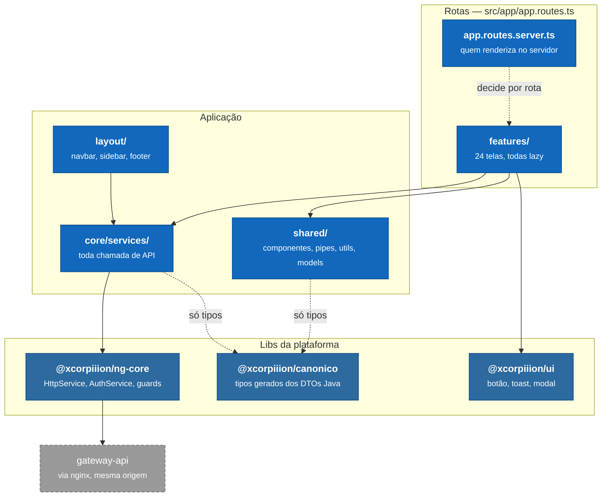
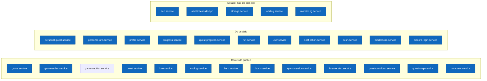
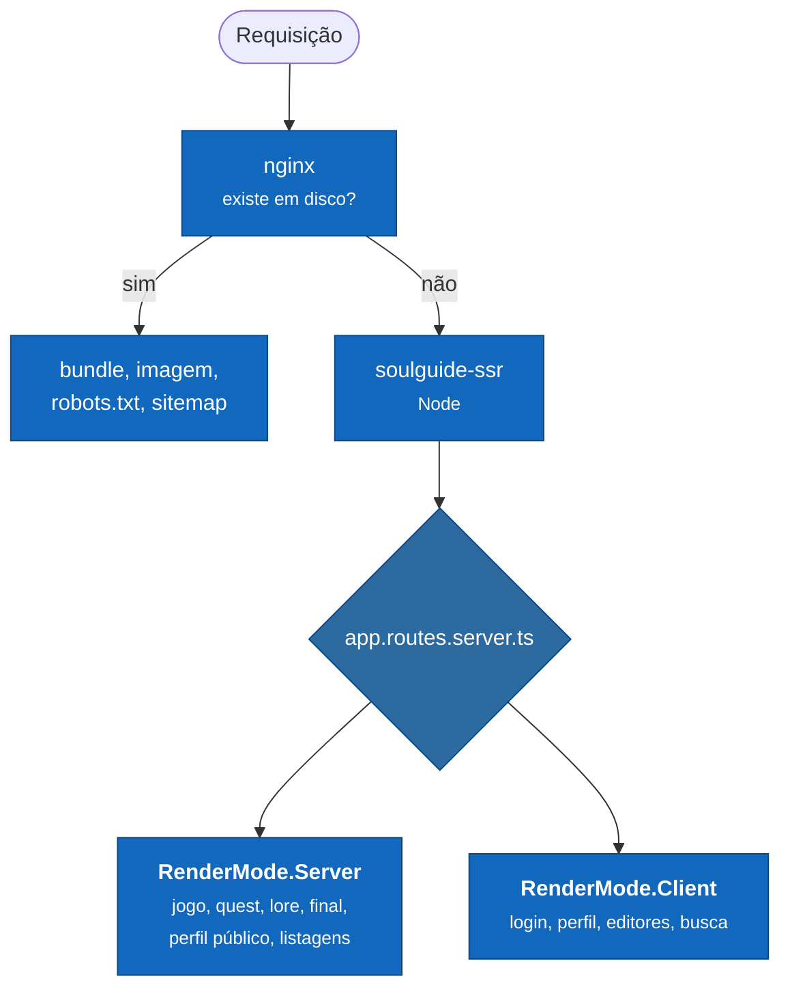

# C4 · Nível 3 — Componentes do front

O que existe dentro do `soulguide-front` e do `soulguide-ssr`. Para os processos e as
portas, ver [Containers](../../../../Back-end/soulsguide/docs/arquitetura/c4-2-containers.md).

---

## 3.1 — As camadas

### O que este desenho decide

**Nenhum componente chama API direto.** Toda chamada passa por um service de
`core/services/`, e todo service passa pelo `HttpService` da plataforma — ver
[ADR 0003](../adr/0003-http-pela-plataforma-environment-num-lugar-so.md).

**`canonico` entra só como tipo.** Ele é gerado dos DTOs Java do back-end, então o
contrato quebra em tempo de compilação aqui quando muda lá. Não há classe dele em tempo de
execução.

**`shared/` não conhece `features/`.** É a direção que permite mover uma tela sem arrastar
o resto junto.

---

## 3.2 — Os services

Um por área do domínio. Todos em `src/app/core/services/`.

Cinco deles não falam **só** com o `souls-guide-api`:

| Service | Com quem fala |
|---|---|
| `user.service` | `user-api`, pelo gateway |
| `storage.service` | `storage-api` para o ticket e os metadados, e **direto com o bucket** para o PUT dos bytes, numa URL assinada |
| `monitoring.service` | Sentry, e só no navegador — ver 3.3 |
| `discord-login.service` | ninguém: monta a URL de autorização do Discord e guarda o `state` no `sessionStorage`. Quem troca o código por token é a `authorization-api`, porque a troca exige o client secret |
| `push.service` | o `souls-guide-api` para a chave VAPID e a inscrição, e **o service worker** para o resto. É ele, e não o servidor, que sabe se *este* aparelho está inscrito — perguntar ao servidor daria a resposta de outro aparelho |

---

## 3.3 — O que renderiza no servidor

A regra é o público: página que um buscador ou um preview de link precisa ler sai pronta
do servidor. Página que só existe depois do login não sai — o servidor não tem sessão, e
renderizar a versão deslogada para jogá-la fora na hidratação é custo sem resultado.

Duas consequências que não avisam quando quebram:

- **o bundle de servidor importa código que assume navegador.** Hoje é o `localStorage`
  que o `@xcorpiiion/ng-core` lê sem guarda de plataforma; `src/ssr-globals.ts` é o
  contorno, e sem ele a renderização morre em todas as rotas de uma vez, porque quem chama
  `isLoggedIn()` é a navbar;
- **nada no SSR pode sair do cabeçalho `Host`** — a base da API vem de `SSR_API_BASE`, o
  domínio canônico de `SITE_URL`.

Ver o [ADR 0009 do back-end](../../../../Back-end/soulsguide/docs/adr/0009-o-html-do-conteudo-sai-do-servidor.md).
